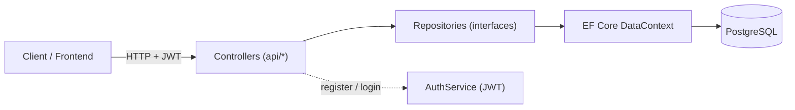
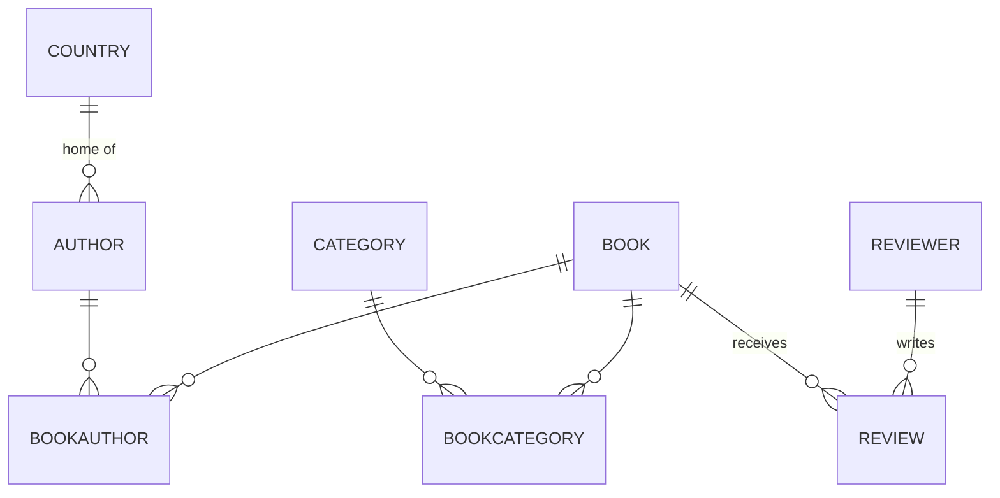

# BookReview API


A RESTful **ASP.NET Core Web API** for cataloguing books, authors, categories, countries, reviewers, and reviews. It demonstrates a clean, layered backend: controllers over a repository layer, Entity Framework Core against PostgreSQL, JWT-based authentication with role support, and a fully Dockerised dev stack.

> This repository is a backend-focused portfolio project. A small React + Vite frontend is included in the Docker stack (on port `3000`), but the API is the centre of attention.

---

## Table of contents

- [Tech stack](#tech-stack)
- [Architecture](#architecture)
- [Domain model](#domain-model)
- [API reference](#api-reference)
- [Authentication](#authentication)
- [Getting started](#getting-started)
- [Configuration](#configuration)
- [Project structure](#project-structure)
- [Engineering work completed](#engineering-work-completed)
- [Roadmap](#roadmap)

---

## Tech stack

| Concern | Technology |
| --- | --- |
| Runtime / framework | .NET 10, ASP.NET Core Web API |
| Data access | Entity Framework Core (Npgsql provider) |
| Database | PostgreSQL 17 |
| Authentication | JWT bearer tokens (HMAC-SHA512), ASP.NET Core Identity password hashing |
| API documentation | OpenAPI + [Scalar](https://github.com/scalar/scalar) interactive reference (development only) |
| Containerisation | Docker / Docker Compose |

---

## Architecture

The API follows a layered design with the **repository pattern** and dependency injection throughout. Controllers never touch the database directly — they depend on repository interfaces, which are the only code that talks to EF Core.



- **Controllers** map HTTP requests to actions, translate between DTOs and entities, and choose the response status code.
- **DTOs** (`Dto/`) are the public shape of the API and carry the input-validation rules; entities (`Models/`, `Entities/`) are never exposed directly.
- **Repositories** (`Repository/` behind `Interfaces/`) encapsulate all data access and are registered as scoped services in `Program.cs`. Every data-access method is **asynchronous**.
- **DataContext** (`Data/`) is the EF Core unit of work; the many-to-many join tables use composite keys configured in `OnModelCreating`.
- On startup the app **applies migrations automatically** and seeds sample data if the database is empty.

---

## Domain model



| Entity | Notes |
| --- | --- |
| **Book** | Title + release date. Linked to authors and categories via join tables. |
| **Author** | Name + bio. Belongs to one **Country**; linked to books many-to-many. |
| **Category** | Genre/classification. Linked to books many-to-many. |
| **Country** | Referenced by authors. |
| **Reviewer** | The person who writes reviews. |
| **Review** | Title, text, rating (1–5), date. Belongs to one **Book** and one **Reviewer**. |
| **BookAuthor** / **BookCategory** | Join entities (composite primary keys) implementing the two many-to-many relationships. |
| **User** | Account for authentication; stores a hashed password and a role. |

---

## API reference

Base URL (Docker dev): `http://localhost:8080`

**All `GET` endpoints are public. All create/update/delete endpoints require a Bearer token** (see [Authentication](#authentication)).

### Auth — `/api/auth`
| Method | Endpoint | Auth | Description |
| --- | --- | --- | --- |
| `POST` | `/register` | — | Create a user account; returns `{ id, username, role }` |
| `POST` | `/login` | — | Authenticate; returns a signed JWT string |
| `GET` | `/admin` | Admin | Example role-protected endpoint |

### Books — `/api/books`
| Method | Endpoint | Auth | Description |
| --- | --- | --- | --- |
| `GET` | `/` | — | List all books |
| `GET` | `/{bookId}` | — | Get one book |
| `GET` | `/{bookId}/rating` | — | Average rating for a book |
| `POST` | `/` | ✓ | Create a book |
| `PUT` | `/{bookId}` | ✓ | Update a book |
| `DELETE` | `/{bookId}` | ✓ | Delete a book |

### Authors — `/api/authors`
| Method | Endpoint | Auth | Description |
| --- | --- | --- | --- |
| `GET` | `/` | — | List all authors |
| `GET` | `/{authorId}` | — | Get one author |
| `GET` | `/book/{bookId}` | — | Authors of a given book |
| `GET` | `/{authorId}/books` | — | Books by a given author |
| `POST` | `/` | ✓ | Create an author |
| `PUT` | `/{authorId}` | ✓ | Update an author |
| `DELETE` | `/{authorId}` | ✓ | Delete an author |

### Categories — `/api/categories`
| Method | Endpoint | Auth | Description |
| --- | --- | --- | --- |
| `GET` | `/` | — | List all categories |
| `GET` | `/{categoryId}` | — | Get one category |
| `GET` | `/{categoryId}/books` | — | Books in a category |
| `POST` | `/` | ✓ | Create a category |
| `PUT` | `/{categoryId}` | ✓ | Update a category |
| `DELETE` | `/{categoryId}` | ✓ | Delete a category |

### Countries — `/api/countries`
| Method | Endpoint | Auth | Description |
| --- | --- | --- | --- |
| `GET` | `/` | — | List all countries |
| `GET` | `/{countryId}` | — | Get one country |
| `GET` | `/authors/{authorId}` | — | Country of a given author |
| `GET` | `/{countryId}/authors` | — | Authors from a country |
| `POST` | `/` | ✓ | Create a country |
| `PUT` | `/{countryId}` | ✓ | Update a country |
| `DELETE` | `/{countryId}` | ✓ | Delete a country |

### Reviewers — `/api/reviewers`
| Method | Endpoint | Auth | Description |
| --- | --- | --- | --- |
| `GET` | `/` | — | List all reviewers |
| `GET` | `/{reviewerId}` | — | Get one reviewer |
| `GET` | `/{reviewerId}/reviews` | — | Reviews by a reviewer |
| `POST` | `/` | ✓ | Create a reviewer |
| `PUT` | `/{reviewerId}` | ✓ | Update a reviewer |
| `DELETE` | `/{reviewerId}` | ✓ | Delete a reviewer |

### Reviews — `/api/reviews`
| Method | Endpoint | Auth | Description |
| --- | --- | --- | --- |
| `GET` | `/` | — | List all reviews |
| `GET` | `/{reviewId}` | — | Get one review |
| `GET` | `/book/{bookId}` | — | Reviews of a given book |
| `POST` | `/` | ✓ | Create a review |
| `PUT` | `/{reviewId}` | ✓ | Update a review |
| `DELETE` | `/{reviewId}` | ✓ | Delete a review |

### Status code conventions

| Code | Meaning |
| --- | --- |
| `200 OK` | Successful read |
| `201 Created` | Resource created — the `Location` header points to the new resource |
| `204 No Content` | Successful update or delete |
| `400 Bad Request` | Invalid body, id mismatch, or unknown related entity (e.g. bad country/book/reviewer reference) |
| `401 Unauthorized` | Missing or invalid token on a protected endpoint |
| `404 Not Found` | Resource does not exist |
| `409 Conflict` | A resource with that name/title already exists |
| `500 Internal Server Error` | Unexpected persistence failure |

When running in development, an interactive **Scalar API reference** is served at `http://localhost:8080/scalar/v1`.

---

## Authentication

Authentication uses **JWT bearer tokens**:

1. **Register** a user (`POST /api/auth/register`). Passwords are hashed with ASP.NET Core Identity's `PasswordHasher`; the hash is never returned. New users get the default role `User`.
2. **Log in** (`POST /api/auth/login`) to receive a signed JWT (HMAC-SHA512, valid for 1 day, with validated issuer/audience/lifetime/signing-key).
3. **Send the token** as `Authorization: Bearer <token>` on any create/update/delete request.

Role claims are embedded in the token; `[Authorize(Roles = "Admin")]` protects admin-only endpoints.

```bash
# 1. Register
curl -X POST http://localhost:8080/api/auth/register \
  -H "Content-Type: application/json" \
  -d '{"username":"demo","password":"Passw0rd!"}'

# 2. Log in — returns a JWT string
curl -X POST http://localhost:8080/api/auth/login \
  -H "Content-Type: application/json" \
  -d '{"username":"demo","password":"Passw0rd!"}'

# 3. Call a protected endpoint with the token
curl -X POST http://localhost:8080/api/categories \
  -H "Authorization: Bearer <token-from-step-2>" \
  -H "Content-Type: application/json" \
  -d '{"name":"Sci-Fi"}'
```

---

## Getting started

### Prerequisites
- [Docker Desktop](https://www.docker.com/products/docker-desktop/) (includes Docker Compose)

### Run with Docker (recommended)

```bash
# from the repository root
cd BookReview

# create the .env file described below in this folder, then:
docker compose up -d --build
```

This starts three containers:

| Service | URL | Notes |
| --- | --- | --- |
| `api` | http://localhost:8080 | The Web API (Scalar docs at `/scalar/v1`) |
| `db` | localhost:5433 | PostgreSQL 17 (mapped from container port 5432) |
| `frontend` | http://localhost:3000 | React + Vite client |

On first start the API applies its EF Core migrations and seeds sample data: 3 countries, 3 authors, 3 categories, 3 books, 2 reviewers, and 2 reviews — so the public `GET` endpoints return data immediately.

Stop everything with:

```bash
docker compose down          # keep data
docker compose down -v       # also drop the database volume
```

### Run the API locally (without Docker)

You still need a PostgreSQL instance — the simplest option is to start only the database container (`docker compose up -d db`) and run the API on the host:

```bash
cd BookReview
dotnet run
```

Provide the connection string and JWT signing key via environment variables or `appsettings.Development.json` (see below).

---

## Configuration

Non-secret settings live in `appsettings.json`:

```json
{
  "AppSettings": {
    "Issuer": "MyApp",
    "Audience": "MyAppUsers"
  }
}
```

**Secrets are supplied via environment variables and are never committed.** The Docker stack reads them from a `.env` file placed next to `compose.yaml` (this file is git-ignored):

```dotenv
# BookReview/.env
POSTGRES_PASSWORD=choose_a_strong_password
JWT_TOKEN=replace_with_a_long_random_secret_at_least_64_characters_long
```

| Variable | Used for |
| --- | --- |
| `POSTGRES_PASSWORD` | PostgreSQL password (database + API connection string) |
| `JWT_TOKEN` | Symmetric signing key for JWTs — use a long random value (HMAC-SHA512 wants ≥ 64 characters) |

Compose maps these onto the app's configuration (`ConnectionStrings__DefaultConnection`, `AppSettings__Token`).

---

## Project structure

```
BookReview/
├─ BookReview/                 # the API project
│  ├─ Controllers/             # Auth + one controller per resource
│  ├─ Interfaces/              # repository & service contracts
│  ├─ Repository/              # EF Core data-access implementations
│  ├─ Services/                # AuthService (JWT issuance, password hashing)
│  ├─ Models/                  # domain entities + join entities
│  ├─ Entities/                # User account entity
│  ├─ Dto/                     # request/response DTOs (with validation)
│  ├─ Data/                    # DataContext (EF Core)
│  ├─ Migrations/              # EF Core migrations
│  ├─ Seed.cs                  # sample-data seeding
│  ├─ Program.cs               # DI, auth, pipeline, startup migrate+seed
│  ├─ compose.yaml             # api + db + frontend
│  ├─ Dockerfile               # API image
│  └─ frontend/                # React + Vite client
└─ README.md
```

---

## Engineering work completed

This project went through a focused round of backend hardening. Each item was implemented, verified against the running Docker stack, and committed separately:

- **Secured write endpoints** — every create/update/delete now requires authentication (`[Authorize]`), while reads stay public (`[AllowAnonymous]`).
- **Stopped leaking password hashes** — registration returns a safe `UserResponseDto` (`id`, `username`, `role`) instead of the full user entity.
- **Input validation** — DTOs carry DataAnnotations rules (required fields, length limits, rating range 1–5), enforced automatically by `[ApiController]`.
- **Null-safety** — resolved nullable-reference warnings and removed paths that could dereference or return null unexpectedly.
- **Removed dead weight** — dropped unused NuGet packages and unreferenced code.
- **Fixed logic bugs** — corrected copy-paste mistakes in existence checks and entity updates (e.g. loading the related country correctly, validating related entities on update).
- **Async data access** — all repository methods are now `async`/`await` over EF Core's async APIs (`ToListAsync`, `FirstOrDefaultAsync`, `SaveChangesAsync`, …), so requests no longer block threads on database I/O.
- **Tidied HTTP semantics** — POSTs return `201 Created` with a `Location` header, duplicates return `409 Conflict`, missing resources return `404`, bad foreign keys return `400`, and the `[ProducesResponseType]` annotations (which drive the OpenAPI docs) match the real responses.

---

## Roadmap

- **Automated tests** — an xUnit test project covering controller behaviour (with a mocked repository) and repository logic (against an in-memory database).
